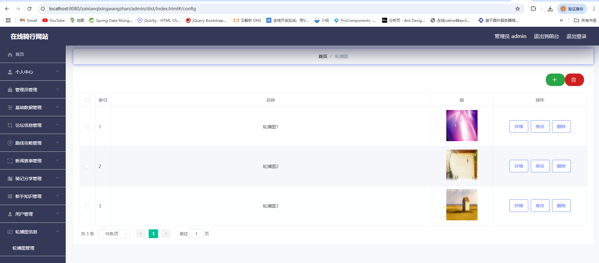

# 一、系统说明

基于springboot+vue的在线骑行网站,系统功能齐全, 代码简洁易懂，适合小白学编程。

# 二、系统架构

######      前端：vue| elementui

######      后端：springboot | mybatis 

######      环境：jdk1.8+ | mysql8.0 | maven

# 三、代码及数据库

四、相关功能介绍

#### 1).客户端

###### 1.登录

###### 2.注册

###### 3.首页

###### 4.详情

5.论坛信息

###### 6.路线攻略

###### 7.新增赛事

###### 8.骑行分享

###### 9.新手知识

###### 10.个人中心

包含: 个人信息、路线攻略收藏、骑行分享收藏、新手知识收藏

#### 2).管理端

###### 1.登录

###### 2.个人中心->修改密码

###### 3.管理员管理

###### 4.基础数据管理->路线数据管理

包含:修改、详情、删除、新增、查询功能

###### 5.基础数据管理->新闻类型管理

包含:新增、详情、删除、查询功能

###### 6.基础数据管理->骑行类型管理

包含:新增、详情、删除、查询功能

###### 7.基础数据管理->知识类型管理

包含:新增、详情、删除、查询功能

###### 8.论坛信息管理

包含:回帖、删帖、详情、修改等功能

###### 9.路线攻略管理

###### 10.路线攻略管理->路线攻略留言管理

###### 11.路线攻略管理->路线攻略收藏管理

###### 12.新闻赛事管理

###### 13.骑行分享管理

###### 14.骑行分享管理->骑行分享留言管理

###### 15.骑行分享管理>骑行分享收藏管理

###### 16.新手知识管理

###### 17.新手知识管理->新手知识留言管理

###### 18.新手知识管理->新手知识收藏管理

###### 19.用户管理

###### 20.轮播图管理

